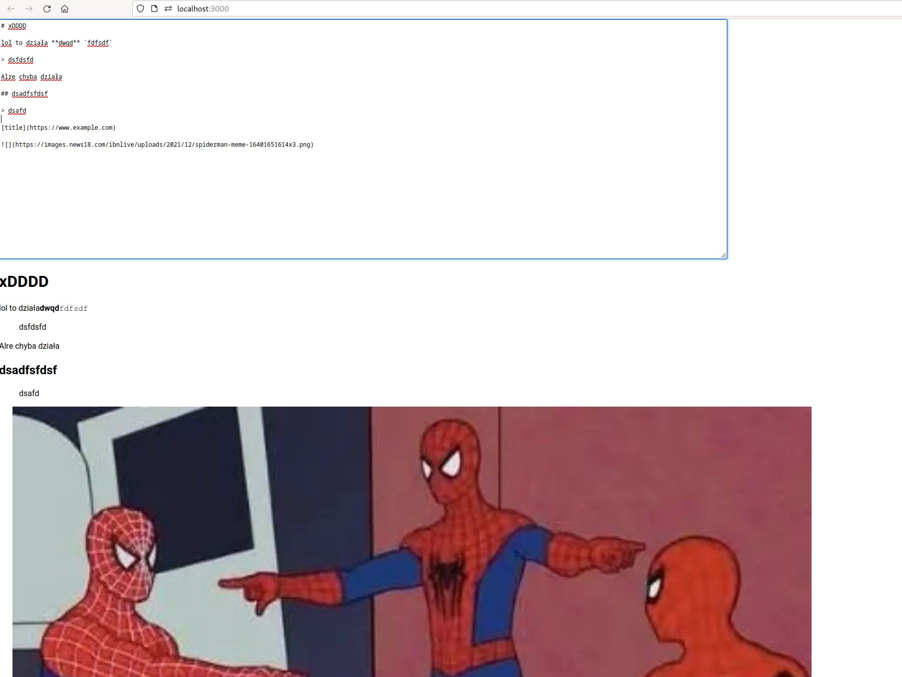

This repository is not a project but a proof of concept for my other project [parserly](https://github.com/filipizydorczyk/parserly). Long term goal for this library is to provide flexible api to create and manipulate markdown files. I finished mvp version of this libarary and wanted to try it in react application to see any issues it might have and how to develop things moving forward. For this I created very minimal markdown editor with parsing source to html components.

I might update this repository if I add major changes to **parserly** just for testing and showcasing

**Things to change**:

-   Failed to parse source map from '/mnt/commondisk/filip/Tests/parerly-tests/poc-parserly-editor/node_modules/parserly/src/utils.ts' file:
-   Missing spaces from parsde paragraph
